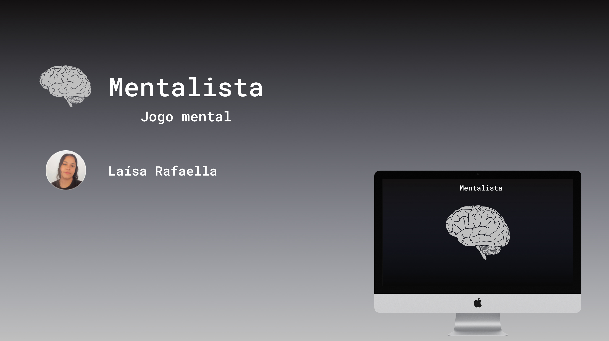

<h1 align="center"> Mentalista </h1>

Programa promovido pela Laísa para ensino de tecnologias WEB.  

  <a href="#-tecnologias">Tecnologias</a>&nbsp;&nbsp;&nbsp;|&nbsp;&nbsp;&nbsp;
  <a href="#-projeto">Projeto</a>&nbsp;&nbsp;&nbsp;|&nbsp;&nbsp;&nbsp;
  <a href="#-layout">Layout</a>&nbsp;&nbsp;&nbsp;|&nbsp;&nbsp;&nbsp;

 

   

## 🚀 Tecnologias

Esse projeto foi desenvolvido com as seguintes tecnologias:

- HTML e CSS
- JavaScript
- Git e Github
- Figma

## 💻 Projeto

O Mentalista é um jogo mental, de adivinhação de números para usar como forma de entretenimento e de aprendizado por estimular o pensamento lógico.

## 🔖 Layout

Desenvolvido no Figma 

---

Feito com ♥ by Laísa :wave: